# [bbradar.io](https://bbradar.io)

Discover public bug bounty programs across 24 platforms, prioritize opportunities with program and target intelligence, detect scope and GitHub branch-head changes, and deliver alerts through the web, Telegram, Discord, API, or MCP.

[Website](https://bbradar.io) · [Pro](https://bbradar.io/pro) · [Docs](https://bbradar.io/docs) · [Latest Targets](https://bbradar.io/latest-targets) · [Platform Intelligence](https://bbradar.io/platforms)

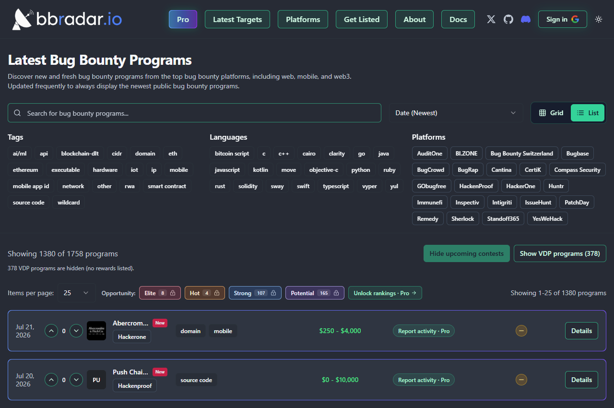

## Product screenshots

<details>
<summary>📸 More screenshots</summary>

### Pro opportunity and target intelligence

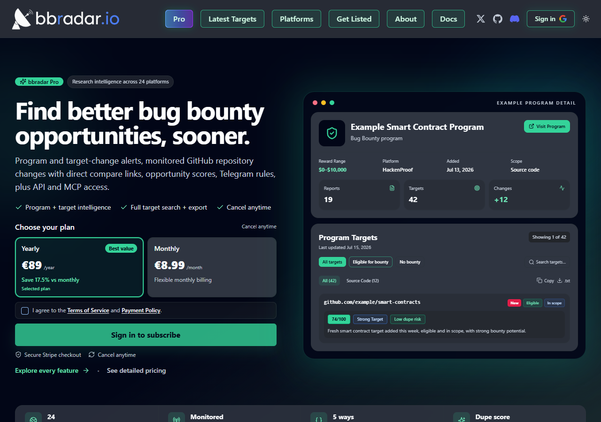

### Program Opportunity Tags

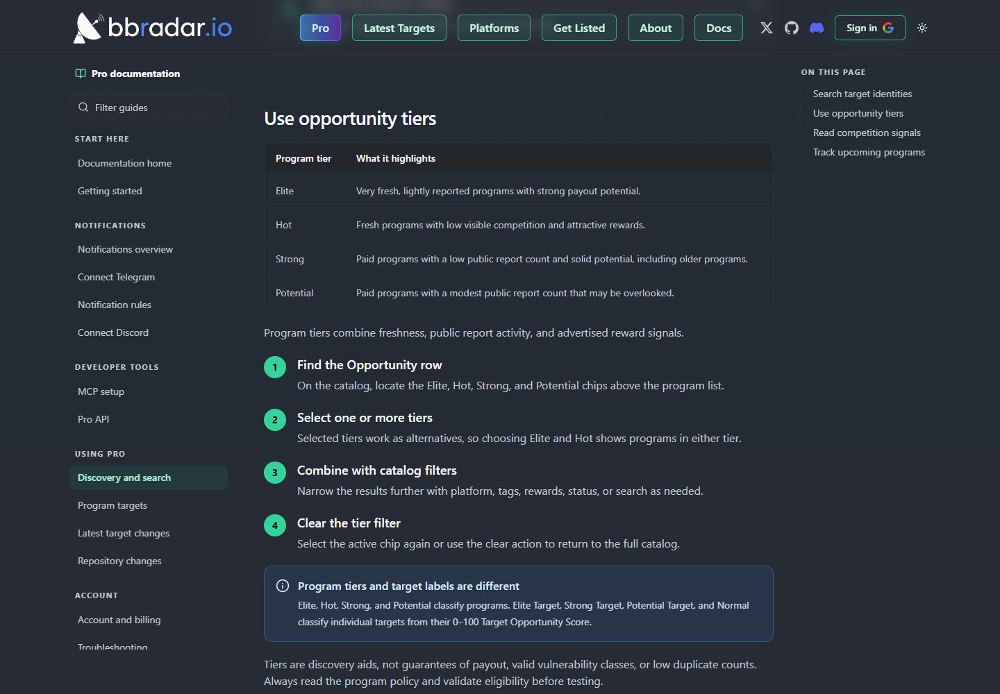

### GitHub commit detection

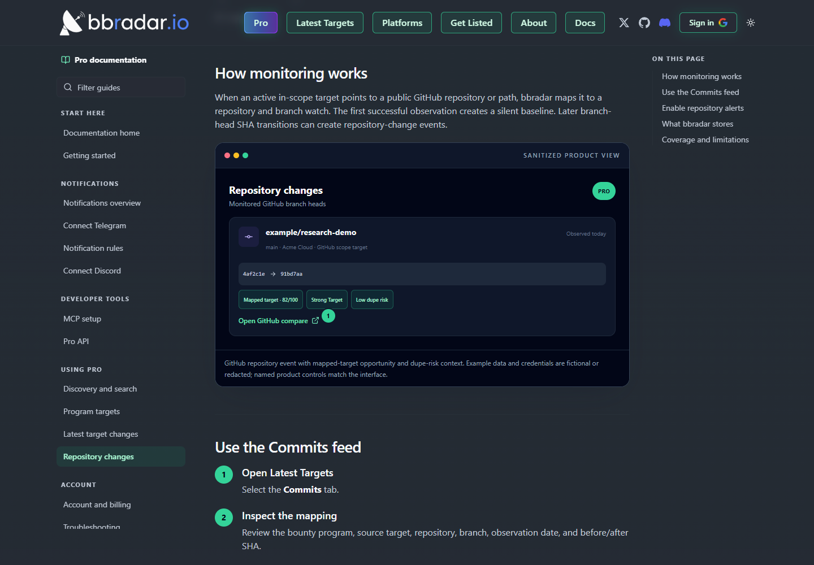

### Personal notification rules

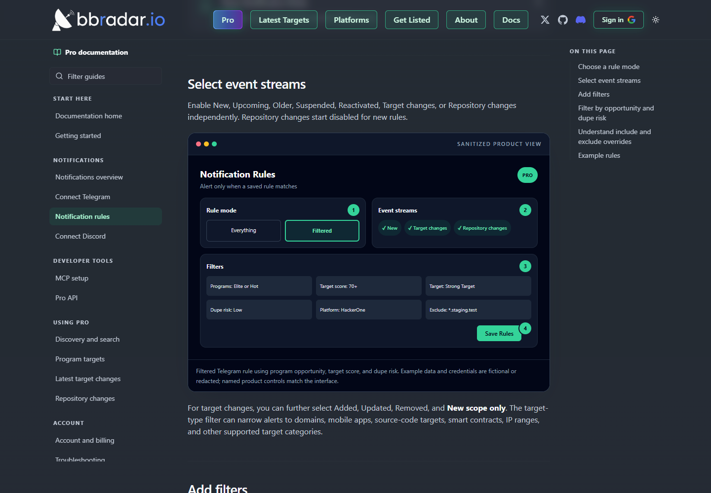

### Latest Targets and Commits

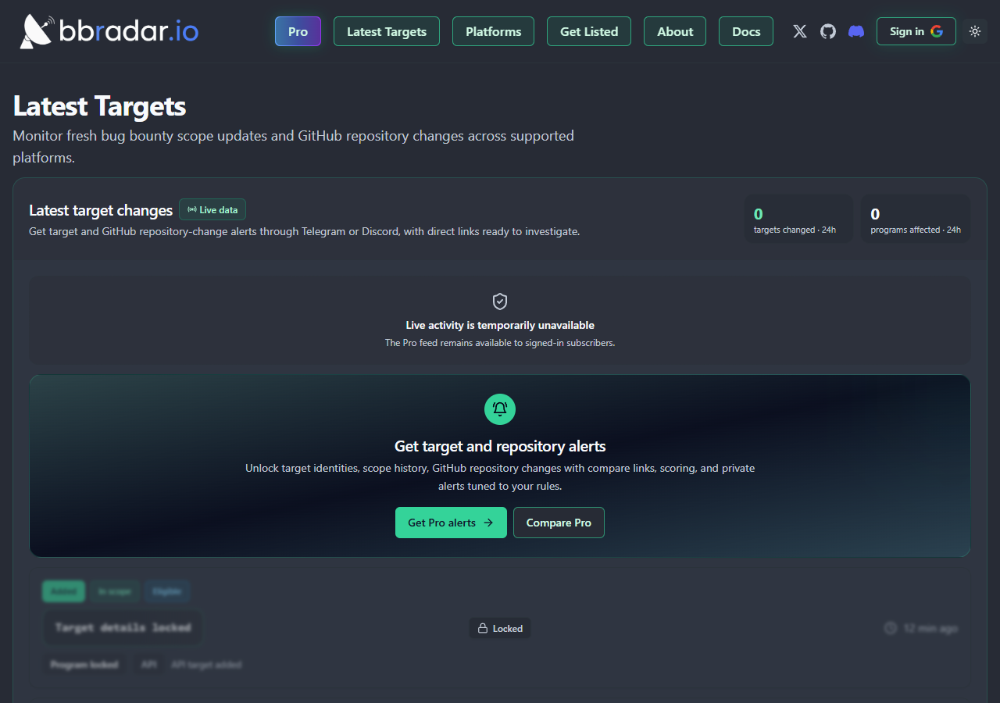

### Filtered target-change feed

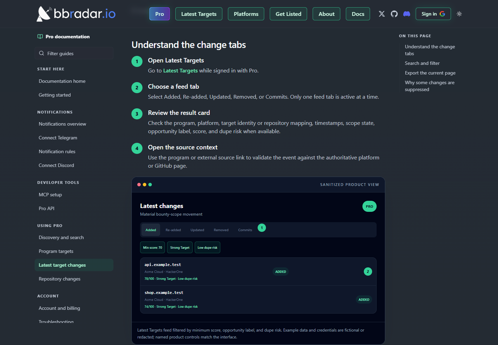

### Platform Intelligence

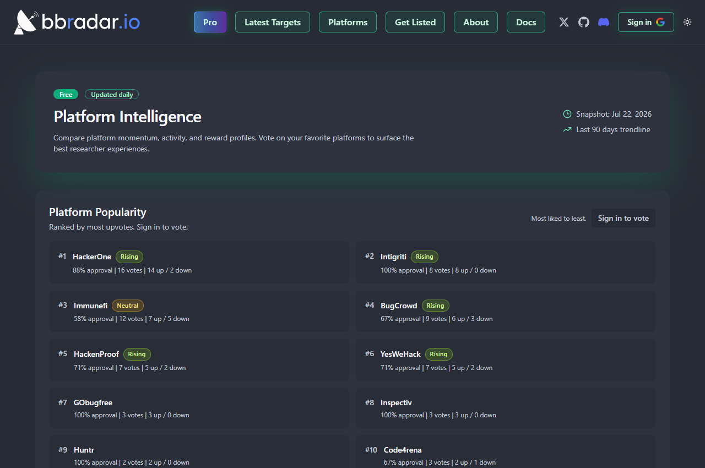

### Pro documentation

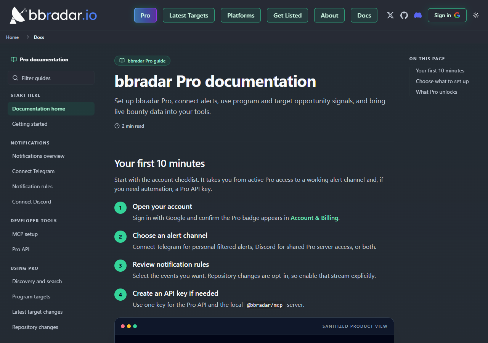

### Light Mode

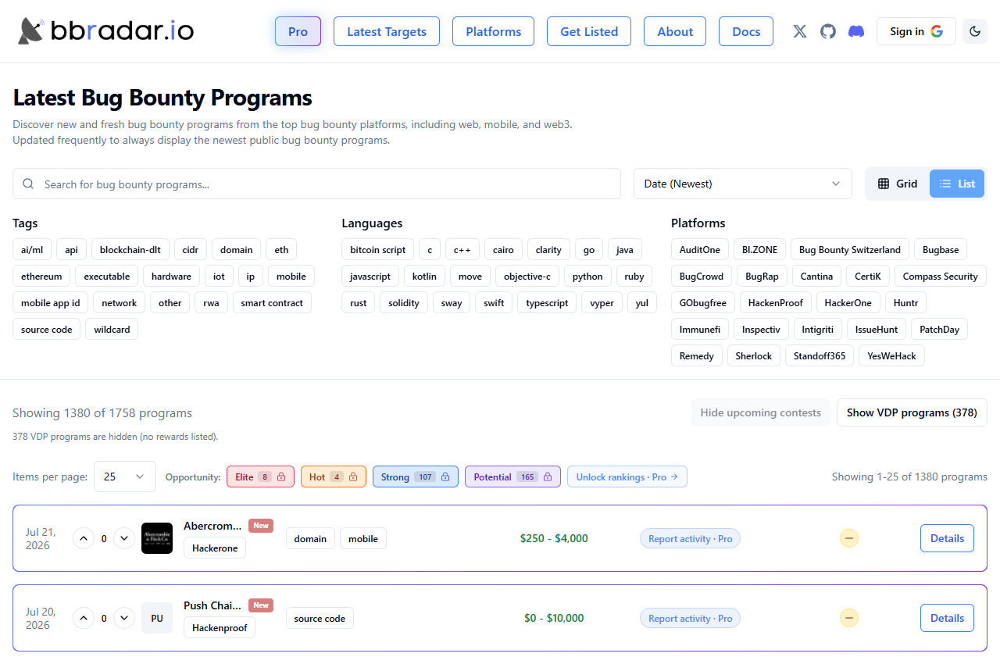

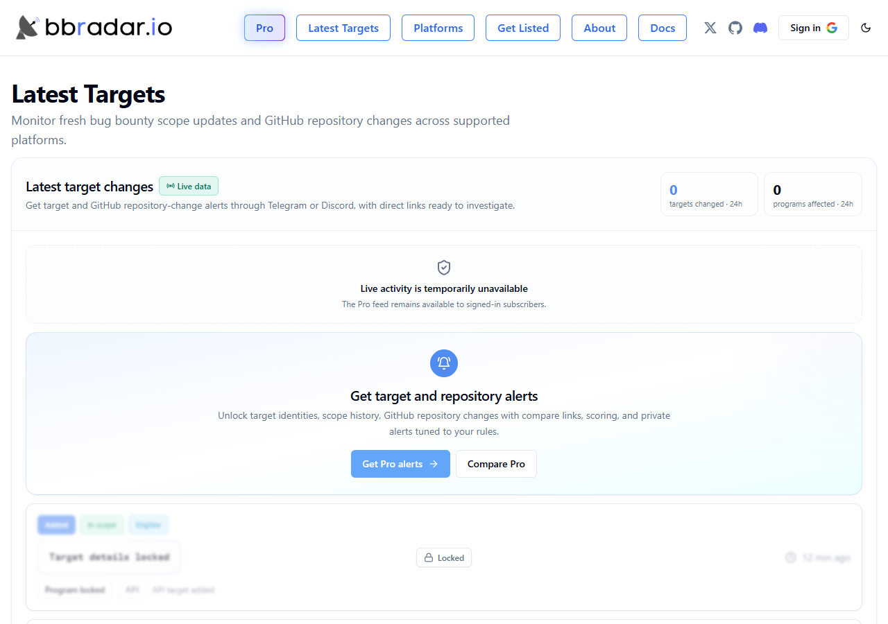

</details>

## Overview

Bug Bounty Radar is a frequently updated discovery and intelligence platform for public bug bounty, vulnerability disclosure, audit, and security contest programs across 24 Web2 and Web3 platforms. It normalizes fragmented program and scope data into one searchable radar, tracks program lifecycle, target, and GitHub repository changes, and surfaces platform trends and community signals.

Beyond aggregation, bbradar helps researchers decide what to investigate next. Pro adds Program Opportunity Tags, 0–100 Target Intelligence, duplicate-risk context, complete scope history, GitHub branch-head detection, private Telegram rules, shared Discord alerts, exports, and programmable access through the Pro API and local MCP server.

## Latest Highlights

<table>
  <tr>
    <td><strong>Program Opportunity Tags</strong></td>
    <td>Rank programs as Elite, Hot, Strong, or Potential from freshness, public report activity, and advertised rewards, with score factors and a supporting reason.</td>
  </tr>
  <tr>
    <td><strong>Target Intelligence</strong></td>
    <td>Review 0–100 target scores, Elite/Strong/Potential labels, factor breakdowns, “Why This Target” explanations, and estimated duplicate/competition risk.</td>
  </tr>
  <tr>
    <td><strong>GitHub Commit Detection</strong></td>
    <td>Detect branch-head SHA transitions for GitHub repositories mapped to active scope, then open the source compare or commit view from the affected program and target.</td>
  </tr>
  <tr>
    <td><strong>Personal Alert Rules</strong></td>
    <td>Send filtered Telegram alerts by event stream, platform, scope, language, bounty, opportunity tier, target score, label, risk, and saved exceptions.</td>
  </tr>
  <tr>
    <td><strong>API + MCP</strong></td>
    <td>Use the Pro API directly or run <code>@bbradar/mcp</code> locally for structured discovery, comparison, opportunity, target, scope-change, export, and research-planning workflows.</td>
  </tr>
  <tr>
    <td><strong>24 Platforms</strong></td>
    <td>Coverage now includes AuditOne, BI.ZONE, Bug Bounty Switzerland, Bugbase, and CertiK alongside the established platform set.</td>
  </tr>
</table>

## At a Glance

<table>
  <tr>
    <td><strong>Scope</strong></td>
    <td>Public bug bounty, VDP, audit, and contest listings across 24 platforms</td>
  </tr>
  <tr>
    <td><strong>Program data</strong></td>
    <td>Platform, type, tags, languages, rewards, dates, lifecycle state, votes, sentiment, report activity, source context, and targets</td>
  </tr>
  <tr>
    <td><strong>Target data</strong></td>
    <td>Identity, eligibility, in-scope state, change type, score, opportunity label, score factors, duplicate risk, and repository mappings where available</td>
  </tr>
  <tr>
    <td><strong>Discovery</strong></td>
    <td>Program and Pro target-aware search, grid/list views, date/name/reward sorting, Pro report-count sorting, VDP and upcoming-contest toggles, plus profile and intelligence filters</td>
  </tr>
  <tr>
    <td><strong>Delivery</strong></td>
    <td>Web, private Telegram alerts, shared Discord channels, Pro API, and local MCP server</td>
  </tr>
  <tr>
    <td><strong>Update cadence</strong></td>
    <td>Listings refresh frequently throughout the day and new public programs usually appear within minutes; platform intelligence snapshots update daily</td>
  </tr>
  <tr>
    <td><strong>Access</strong></td>
    <td>Free public discovery and platform intelligence; Pro for scores, full target tooling, alerts, repository monitoring, API, and MCP</td>
  </tr>
</table>

## Key Features

### Discovery

- **Unified program feed** — Track public programs across major Web2, Web3, audit, contest, and VDP platforms in one place.
- **Powerful search and filters** — Search public programs by name or handle; Pro can also match active target identities from a three-character hostname, package, repository, contract, IP range, or other identifier fragment.
- **Program lifecycle visibility** — Follow New, Upcoming, Older, Suspended, and Reactivated program states with source URLs and update timestamps. Future-dated contests stay public; Pro can also surface upcoming non-contest programs.
- **Flexible browsing** — Switch between grid and list views, choose page size, show or hide VDPs and upcoming contests, and sort by date, name, or bounty. Report-count sorting is available with Pro.
- **Community signals** — Sign in with Google to vote on programs and platforms; browse approval, popularity, and sentiment labels.

### Opportunity and Target Intelligence

- **Program Opportunity Tags** — Prioritize Elite, Hot, Strong, and Potential programs using a score breakdown, reason, reward context, freshness, and available public report activity.
- **Target Opportunity Scores** — Rank supported targets from 0–100 as Elite Target, Strong Target, Potential Target, or Normal.
- **Why This Target** — See a plain-language explanation and the factors behind a target’s score.
- **Duplicate/competition risk** — Use Low, Medium, High, or Unknown estimates based on public report activity, age or freshness, target type, and other available context. Unknown means insufficient data, not low risk.
- **Complete target history** — Explore added, re-added, updated, and removed target events with eligibility and scope state.
- **Copy and export** — Copy one target or export the current/filtered target results as `.txt` in 5, 10, or 50 rows.
- **GitHub commit detection** — Monitor branch-head SHA changes for GitHub repositories detected in active scope and open direct compare or commit links. bbradar maps activity to programs without copying code, patches, filenames, or commit messages.

### Alerts and Automation

- **Private Telegram alerts** — Build personal 1:1 DM rules in Everything or Filtered mode. Groups and Telegram channels are not supported.
- **Independent event streams** — Enable New, Upcoming, Older, Suspended, Reactivated, Target changes, or Repository changes separately; repository alerts start disabled and require opt-in.
- **Fine-grained rules** — Filter on platform, scope tags, language, bounty range, program tier, target score and label, duplicate risk, target type, change type, and include/exclude exceptions.
- **Shared Discord access** — Receive community-wide Pro updates in shared Discord channels; personal Telegram rules do not change Discord delivery.
- **Pro API** — Query programs, opportunity tiers, active program targets, and material target changes with a personal Bearer token.
- **Local MCP server** — Connect bbradar data to Codex, Claude Code, OpenCode, or another compatible client with Node.js 20+ and `npx -y @bbradar/mcp`.

### Platform Analytics

- **Daily Platform Intelligence** — Compare active-program counts, recent launches, VDP share, reward profiles, and 7/30/90-day momentum.
- **Community rankings** — Rank platforms by votes and approval, with Rising or Neutral labels where enough signal exists.
- **Platform drill-downs** — Open platform-specific program views directly from the analytics dashboard.

## Opportunity Tags and Target Scores

Program Opportunity Tags rank the parent program. They combine freshness, public report activity, and advertised reward signals. Selecting multiple tags uses OR semantics within that group, then combines with the other active catalog filters.

| Program tag | What it highlights |
| --- | --- |
| **Elite** | Very fresh, lightly reported programs with strong payout potential |
| **Hot** | Fresh programs with low visible competition and attractive rewards |
| **Strong** | Paid programs with a low public report count and solid potential, including older programs |
| **Potential** | Paid programs with a modest public report count that may be overlooked |

Target Opportunity Scores rank one target rather than its parent program:

| Target label | Score band |
| --- | ---: |
| **Elite Target** | 85–100 |
| **Strong Target** | 70–84 |
| **Potential Target** | 50–69 |
| **Normal** | 0–49 |

Target Intelligence combines freshness, target type, advertised reward, and public report activity. Eligible targets can include the score, label, factor breakdown, duplicate-risk badge and reason, and a plain-language **Why This Target** explanation. Out-of-scope or explicitly ineligible targets do not receive Target Intelligence.

These signals are comparative discovery aids, not guarantees of payout, low duplicates, authorization, or vulnerability validity. Always confirm active scope, eligibility, and the upstream program policy before testing.

## Latest Targets and Scope Changes

The Pro feed separates target and repository activity into five tabs:

| Feed | Meaning |
| --- | --- |
| **Added** | A newly confirmed canonical target entered active scope |
| **Re-added** | A previously seen target returned to active scope |
| **Updated** | A material property of an existing target changed |
| **Removed** | A target left active scope after removal safeguards and confirmation |
| **Commits** | A monitored GitHub branch head moved; this is a separate repository feed |

Search accepts target, program, repository, branch, or SHA fragments from two characters. Filters cover scope state, platform, tags, languages, minimum Target Opportunity Score, one target label, and one duplicate-risk level. Score, label, and risk filters on the Commits tab are evaluated against the bounty target mapped to each repository event.

Target feeds can copy or download 5, 10, or 50 unique identities from the currently loaded, filtered page. This is not a bulk historical dump, and repository changes do not currently have an export control.

The feed suppresses historical backfills, normalization-only migrations, unchanged reactivations, unconfirmed additions, and other non-actionable transitions. Empty or suspiciously large removals are guarded so a partial upstream response does not appear as a genuine scope clear.

## GitHub Commit Detection

When an active in-scope target points to a public GitHub repository or path, bbradar maps it to a repository and branch watch. The first successful observation creates a silent baseline; later branch-head SHA transitions can create repository-change events.

- **Commits feed context** — Review the bounty program, source target, repository, branch, observation time, before/after SHA, mapped-target score and label, and duplicate risk.
- **Source-first investigation** — Open a GitHub compare view, or a commit page when no comparison base exists.
- **Mapped-target filtering** — Narrow results and Telegram delivery by platform, parent-program Opportunity Tag, scope, language, target type, reward, target score, target label, duplicate risk, program, or target pattern.
- **Adaptive monitoring** — Active branches are polled adaptively. The browser refreshes the visible Commits feed about once per minute while that tab is active.
- **Explicit alerts** — Repository changes are a separate Telegram event stream and start disabled for new rules. A multi-program event is delivered when at least one program-to-target mapping matches the complete saved rule.
- **Minimal retention** — Durable events keep the repository/ref, before and after SHA, source, deduplication and delivery state, and affected-program links. bbradar does not retain code, patches, diffs, source files, commit messages, changed paths, or addition/deletion details.

Current boundaries:

- GitHub is the monitored repository provider; GitLab, Bitbucket, Codeberg, and other repository-shaped targets can be recognized as source-code scope but do not receive ref monitoring.
- Tags and pinned commits are mapped but not polled. The first observation is always a silent baseline.
- Private repositories are monitored only when bbradar has configured token access; there is no user-facing GitHub App installation flow.
- Repository events are not exported, broadcast through browser WebSockets, or exposed by the current Pro API or MCP package. Use the web Commits feed or opt-in Telegram stream.

## Free vs Pro

| Capability | Free | Pro |
| --- | :---: | :---: |
| Programs aggregated across 24 platforms | ✓ | ✓ |
| Core program search, filters, sorting, and views | ✓ | ✓ |
| Public future-dated contests | ✓ | ✓ |
| Platform Intelligence and community voting | ✓ | ✓ |
| Upcoming non-contest visibility | — | ✓ |
| Target-aware program search and report-count sorting | — | ✓ |
| Program Opportunity Tags, scores, factors, and reasons | — | ✓ |
| Full targets, target search, history, and intelligence | — | ✓ |
| GitHub branch-head detection, Commits feed, and source links | — | ✓ |
| Copy and `.txt` export actions | — | ✓ |
| Private Telegram rules and shared Discord access | — | ✓ |
| Pro API and local MCP server | — | ✓ |

Pro is available on monthly or yearly billing, with the same feature set on both plans. See current pricing on the [Pro page](https://bbradar.io/pro).

## Developer Access

Create one personal API key from Account & Billing and send it as a Bearer token. The complete `bbr_live...` secret is displayed once; regenerating it immediately invalidates the previous key. Keep it in a secret manager or protected environment variable and never expose it in frontend JavaScript.

The current Pro API includes:

```text
GET /api/v1/pro/programs
GET /api/v1/pro/opportunities/{level}
GET /api/v1/pro/programs/{program_id}/targets
GET /api/v1/pro/targets/changes
```

Successful list responses are paginated. The programs endpoint can return `competitionRisk` and its reason. The opportunities endpoint returns `opportunity_tag` with the tier, score, factors, and reason. Target endpoints can filter by minimum score, target label, and competition risk, and return Target Intelligence when the source data and eligibility support it.

The same key powers the local STDIO [`@bbradar/mcp`](https://www.npmjs.com/package/@bbradar/mcp) server on Node.js 20+:

```bash
npx -y @bbradar/mcp
```

Current MCP capabilities include:

- Program search, lookup, name resolution, comparisons, activity summaries, briefs, and deltas
- Opportunity tiers and low-competition/high-reward discovery
- Target-aware, wildcard, Web3, contest, reward, language, type, VDP, paid-program, stack-match, and recent-program discovery
- Program targets, scope summaries, target breakdowns, latest additions, recent activity, scope deltas, watchlist checks, and target export
- Built-in status and usage guides through `get_mcp_status` and `get_bbradar_guide`
- Prompt templates for finding programs to hunt, summarizing scope, and preparing a recon plan

See the [API guide](https://bbradar.io/docs/api) and [MCP setup guide](https://bbradar.io/docs/mcp) for authentication, parameters, client configuration, limits, and security guidance.

> Repository-change events are currently available through the web Commits feed and opt-in Telegram stream, not through the Pro API or MCP.

## Accounts and Billing

- Google is the current sign-in provider. Discord is an optional Pro integration and role-assignment flow, not a login method.
- Monthly and yearly billing include the same Pro features; see the [live Pro page](https://bbradar.io/pro) for current prices.
- Stripe handles checkout and the billing portal for invoices, payment methods, eligible plan changes, and cancellation.
- A canceled paid subscription normally retains Pro access through the end of its paid period. Private data delivery stops after access expires, and Discord role reconciliation can remove the Pro role.

## Supported Platforms

<table>
  <tr>
    <td><a href="https://bbradar.io/platforms/auditone">AuditOne</a></td>
    <td><a href="https://bbradar.io/platforms/bi-zone">BI.ZONE</a></td>
    <td><a href="https://bbradar.io/platforms/bug-bounty-switzerland">Bug Bounty Switzerland</a></td>
  </tr>
  <tr>
    <td><a href="https://bbradar.io/platforms/bugbase">Bugbase</a></td>
    <td><a href="https://bbradar.io/platforms/bugcrowd">Bugcrowd</a></td>
    <td><a href="https://bbradar.io/platforms/bugrap">BugRap</a></td>
  </tr>
  <tr>
    <td><a href="https://bbradar.io/platforms/cantina">Cantina</a></td>
    <td><a href="https://bbradar.io/platforms/certik">CertiK</a></td>
    <td><a href="https://bbradar.io/platforms/code4rena">Code4rena</a></td>
  </tr>
  <tr>
    <td><a href="https://bbradar.io/platforms/codehawks">CodeHawks</a></td>
    <td><a href="https://bbradar.io/platforms/compass-security">Compass Security</a></td>
    <td><a href="https://bbradar.io/platforms/gobugfree">GoBugFree</a></td>
  </tr>
  <tr>
    <td><a href="https://bbradar.io/platforms/hackenproof">HackenProof</a></td>
    <td><a href="https://bbradar.io/platforms/hackerone">HackerOne</a></td>
    <td><a href="https://bbradar.io/platforms/huntr">Huntr</a></td>
  </tr>
  <tr>
    <td><a href="https://bbradar.io/platforms/immunefi">Immunefi</a></td>
    <td><a href="https://bbradar.io/platforms/inspectiv">Inspectiv</a></td>
    <td><a href="https://bbradar.io/platforms/intigriti">Intigriti</a></td>
  </tr>
  <tr>
    <td><a href="https://bbradar.io/platforms/issuehunt">IssueHunt</a></td>
    <td><a href="https://bbradar.io/platforms/patchday">PatchDay</a></td>
    <td><a href="https://bbradar.io/platforms/remedy">Remedy</a></td>
  </tr>
  <tr>
    <td><a href="https://bbradar.io/platforms/sherlock">Sherlock</a></td>
    <td><a href="https://bbradar.io/platforms/standoff365">Standoff365</a></td>
    <td><a href="https://bbradar.io/platforms/yeswehack">YesWeHack</a></td>
  </tr>
</table>

New platforms are added regularly. Want one added? Open an [issue](https://github.com/bbradar-io/bbradar.io/issues) or [reach out on X](https://x.com/Kle0z).

## Discovery Filters

Current scope and technology tags include [AI/ML](https://bbradar.io/tags/ai-ml), [API](https://bbradar.io/tags/api), [blockchain/DLT](https://bbradar.io/tags/blockchain-dlt), [CIDR](https://bbradar.io/tags/cidr), [domain](https://bbradar.io/tags/domain), [executable](https://bbradar.io/tags/executable), [hardware](https://bbradar.io/tags/hardware), [IoT](https://bbradar.io/tags/iot), [IP](https://bbradar.io/tags/ip), [mobile](https://bbradar.io/tags/mobile), [network](https://bbradar.io/tags/network), [other](https://bbradar.io/tags/other), [RWA](https://bbradar.io/tags/rwa), [smart contract](https://bbradar.io/tags/smart-contract), [source code](https://bbradar.io/tags/source-code), and [wildcard](https://bbradar.io/tags/wildcard).

Language filters include Bitcoin Script, C, C++, Cairo, Clarity, Go, Java, JavaScript, Kotlin, Move, Objective-C, Python, Ruby, Rust, Solidity, Sway, Swift, TypeScript, Vyper, and Yul.

## Why bbradar.io

Checking every platform manually is slow and makes it easy to miss fresh scope. bbradar.io provides one current view of public programs, target changes, platform activity, and research signals so you can spend less time tab hopping and more time investigating the right opportunities.

bbradar is an independent tracker, not a vulnerability-submission platform. It focuses on public programs rather than private or invite-only listings. Submit reports through the official platform link, and treat the upstream program policy as authoritative whenever its scope differs from aggregated data.

## Helpful Links

- [Pro](https://bbradar.io/pro)
- [Documentation](https://bbradar.io/docs)
- [Discovery and search](https://bbradar.io/docs/pro/discovery)
- [Program targets](https://bbradar.io/docs/pro/program-targets)
- [Latest target changes](https://bbradar.io/docs/pro/latest-changes)
- [GitHub repository changes](https://bbradar.io/docs/pro/repository-changes)
- [Notification rules](https://bbradar.io/docs/notifications/rules)
- [MCP setup](https://bbradar.io/docs/mcp)
- [Pro API](https://bbradar.io/docs/api)
- [Account and billing](https://bbradar.io/docs/account-and-billing)
- [LLM documentation index](https://bbradar.io/llms.txt)
- [Latest Targets](https://bbradar.io/latest-targets)
- [Platform Intelligence](https://bbradar.io/platforms)
- [Get Listed](https://bbradar.io/get-listed)
- [FAQ](https://bbradar.io/faq)

## Contributing

Have an idea, found a bug, or want a new platform supported? Please open an [issue](https://github.com/bbradar-io/bbradar.io/issues).

## Contact

- [X / Twitter](https://x.com/Kle0z)
- [Discord](https://discord.gg/4DAm4Gg8JC)
- [Email](mailto:hello@bbradar.io)
- [GitHub Issues](https://github.com/bbradar-io/bbradar.io/issues)

If you are a platform owner or researcher with feedback, feel free to reach out.

---

If you find bbradar.io useful, please star the [bbradar.io repository](https://github.com/bbradar-io/bbradar.io) and share the site. It helps other researchers discover new programs faster. 🔎
